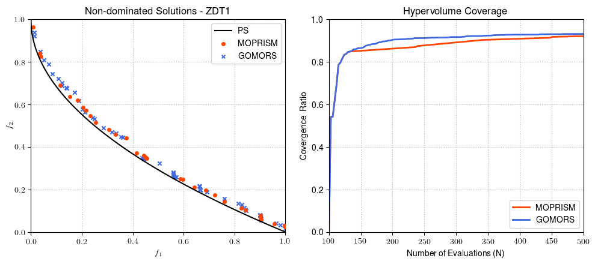

# Surrogate-Embedded MOEA ToolBOX

> *!!!* UNDER DEV WARNING *!!!* 
>
> This library is still under development. 
> 
> All the [examples](https://github.com/NikoZHAI/samolib/tree/master/examples/Benchmarking) are reproducible, but care should be taken when using this tool in production. 

## User Guide 

Before using this tool, one is ought to choose or define:
1. The problem to be optimized
2. Use a premade framework (recommended for the current stage) 
3. The MOEA
4. The surrogate(s)

### The Problem Class

There are two recommended ways two construct a `Problem`:

1. Construct your problem with the `samolib._utils.construct_problem` method.

    ```python
    import numpy as np
    from samolib._utils import construct_problem

    # Write your objective functions, i.e. the ZDT-1 function
    def zdt1(x):
        f1 = x[0]
        g = np.add(1.0, np.multiply(9./29., np.sum(x[1:])))
        f2 = np.multiply(g, (1. - np.sqrt(np.divide(f1, g))))

        return np.array([f1, f2])

    dim    = 30                                 # Dimension of the problem
    n_objs = 2                                  # Number of objectives
    bounds = np.repeat([[0., 1.]], dim, axis=0) # Boundaries of the decision variables

    # Construct your problem
    my_problem = construct_problem(dim=dim, n_objs=n_objs, fun=zdt1, bounds=bounds)
    ```

2. Build your problem from scratch, using `samolib._utils.UnconstainedProblem` as parent class:

    ```python
    import numpy as np
    from samolib._utils import UnconstrainedProblem

    # Construct your problem
    class ZDT1(UnconstrainedProblem, ZDT_SOLUTION_MIXIN):
        def __init__(self):
            super(ZDT1, self).__init__(dim=30, n_objs=2, fun=zdt1)
            self.bounds = np.repeat([[0., 1.]], self.dim, axis=0)
            return None

        # The following function is optional, it computes the analytical optima of the ZDT-1 problem
        def solutions(self, resolution=1000):
            xs = np.zeros((resolution+1, self.dim))
            xs[:, 0] = np.linspace(0., 1., resolution+1)

            return np.apply_along_axis(self.fun, 1, xs)
    ```

### Choose Algorithm Framework

For the moment, we implemented two algorithm frameworks MOPRISM (**M**ulti-objective **O**ptimization by **PR**ogressive **I**mprovement **S**urrogate **M**odel) and GOMORS (proposed in [Akhtar and Shoemaker 2016 ](https://link.springer.com/article/10.1007/s10898-015-0270-y)). An [example](#choose-moea) of how to instantiate a premade algorithm object is present in the next section.


### Choose MOEA

This tool has implemented a naive MOEA (with random crossover operator, gaussian mutation operator for real-valued problems and random mutator for integer problems). For this option, you probably don't need to specify your option when declaring your algorithm. 

The premade algorithm frameworks have implemented interfaces to communicate with MOEAs imported from the [**PYGMO**](https://esa.github.io/pagmo2/) library. **PYGMO** is implemented with C/C++, and runs relatively fast. A list of availble EAs in **PYGMO** can be found [here](https://esa.github.io/pagmo2/docs/algorithm_list.html). Since we are interested in MOPs, only NSGA-II and MOEAD are available in our toolbox to be chosen as embedded MOEA. Here is an example to declare MOPRISM with embedded MOEAD:

```python
from samolib.ea import MOEAD
from samolib.premade import MOPRISM
from samolib.benchmarks import Kursawe

# Define problem
prob = Kursawe()

# Declare MOPRISM with MOEAD embedded
mop = MOPRISM(size=100, problem=prob, max_generation=50, reference=[-14, 0.],
              minimize=True, stopping_rule='max_eval', max_eval=5000,
              revolution=True, embedded_ea=MOEAD, local_search=True,
              verbose=True, verbosity=5)
```

### Choose Surrogate(s)

For the moment, some ML models are available in this toolbox. The `samolib.surrogates.NeuralNet`, `samolib.surrogates.Kriging`, `samolib.surrogates.SVM` are implemented based on [Scikit-Learn](http://scikit-learn.org/stable/). The `samolib.surrogates.RBFN` is based on [pySOT](https://github.com/dme65/pySOT).

```python
from sklearn.preprocessing import StandardScaler as X_SCALER

# Just apply sklearn.neural_network.MLPRegressor parameters here
params_surrogate = params_surrogate = \
    {'hidden_layer_sizes': (6, 6),
     'activation': 'logistic',
     'solver': 'adam',
     'early_stopping': False,
     'batch_size': 32,
     'warm_start': True,
     'beta_1': 0.9,
     'beta_2': 0.999,
     'epsilon': 1e-12,
     'alpha': 1e-3,
     'learning_rate': 'constant',
     'learning_rate_init': 0.0005,
     'max_iter': 500,
     'verbose': False,
     'no_improvement_tol': 4,
     }

# Configure the surrogate
mop.config_surrogate(typ='ANN', params=params_surrogate, n_process=2,
                     X_scaler=X_SCALER(), warm_start=True)
```

## Full Example


```python
import sys, os
import numpy as np
import itertools
sys.path.append('/home/niko/Documents/SPr-GAN/00_Projects/MOPRISM/77_Playground/GA/samolib/')

from premade import MOPRISM
from ea import MOEAD
from _utils import nsga_crossover, gaussian_mutator, random_crossover
from sklearn.preprocessing import StandardScaler
from benchmarks import ZDT1

# RBFN surrogate kernels
from pySOT.kernels import CubicKernel
from pySOT.tails import LinearTail

import matplotlib.pyplot as plt
from matplotlib import rc

# Matplotlib
rc('font', **{'family': 'sans-serif', 'sans-serif': ['Helvetica']})
# for Palatino and other serif fonts use:
# rc('font',**{'family':'serif','serif':['Palatino']})
rc('text', usetex=True)

PROBLEM         = ZDT1()
POP_SIZE        = 100
MAX_GENERATION  = 50
MAX_EPISODE     = 100
MAX_EVAL        = 500
STOPPING_RULE   = 'max_eval'
MUTATION_RATE   = 0.1
MUTATION_U      = 0.
MUTATION_ST     = 0.2
REF             = [1., 1.]
MINIMIZE        = True
VERBOSE         = True
LOCAL_SEARCH    = True
X_SCALER        = StandardScaler

# Set global numpy random_state
np.random.seed(0)

theo = PROBLEM.solutions()

# Instantiate a population
mop = MOPRISM(size=POP_SIZE, problem=PROBLEM, max_generation=MAX_GENERATION,
              max_episode=MAX_EPISODE, reference=REF, minimize=MINIMIZE,
              stopping_rule=STOPPING_RULE, max_eval=MAX_EVAL,
              mutation_rate=MUTATION_RATE, revolution=True,
              embedded_ea=MOEAD, local_search=LOCAL_SEARCH, verbose=VERBOSE)

mop.selection_fun = mop.compute_front
mop.mutation_fun = gaussian_mutator
mop.crossover_fun = random_crossover

# Parametrization
params_ea = {'u': MUTATION_U,
             'st': MUTATION_ST,
             'trial_method': 'lhs',
             'trial_criterion': 'cm'}

kernel = CubicKernel
tail = LinearTail

params_surrogate = \
    {'kernel': kernel,
     'tail': tail,
     'maxp': MAX_EVAL + POP_SIZE,
     'eta': 1e-8,
     }

# Cofigure surrogate, local search and sampler
mop.config_surrogate(typ='rbf', params=params_surrogate, n_process=1,
                     X_scaler=X_SCALER(), warm_start=True)

mop.config_gap_opt(at='least_crowded', radius=0.1, size=POP_SIZE,
                   max_generation=MAX_GENERATION, selection_fun=None,
                   mutation_fun=None, mutation_rate=None,
                   crossover_fun=random_crossover, trial_method='lhs',
                   trial_criterion='cm', u=0., st=0.2)

mop.config_sampling(methods='default', sizes='default', rate='default',
                    candidates='default')

mop.run(params_ea=params_ea,
        params_surrogate=params_surrogate,
        theo=theo)
```


```python
# Do the same with GOMORS
from premade import GOMORS

# Set global numpy random_state
np.random.seed(0)

theo = PROBLEM.solutions()

# Instantiate a population
gom = GOMORS(size=POP_SIZE, problem=ZDT1(), max_generation=MAX_GENERATION,
             max_episode=MAX_EPISODE, reference=REF, minimize=MINIMIZE,
             stopping_rule=STOPPING_RULE, max_eval=MAX_EVAL,
             mutation_rate=MUTATION_RATE, embedded_ea=MOEAD,
             local_search=LOCAL_SEARCH, verbose=VERBOSE)

gom.selection_fun = gom.compute_front
gom.mutation_fun = gaussian_mutator
gom.crossover_fun = random_crossover

# Cofigure surrogate, local search and sampler
gom.config_surrogate(typ='rbf', params=params_surrogate, n_process=1,
                     X_scaler=X_SCALER(), warm_start=True)

gom.config_gap_opt(at='least_crowded', radius=0.1, size=POP_SIZE,
                   max_generation=MAX_GENERATION, selection_fun=None,
                   mutation_fun=None, mutation_rate=None,
                   crossover_fun=random_crossover, trial_method='lhs',
                   trial_criterion='cm', u=0., st=0.2)

gom.config_sampling(methods='default', sizes='default', rate='default',
                    candidates='default')

gom.run(params_ea=params_ea,
        params_surrogate=params_surrogate,
        theo=theo)
```

### Visualization


```python
ref = PROBLEM.solutions()                   # Compute analytical solutions
fs_mop = mop.render_targets('true_front')   # Found objective values
hv_ind_mop = mop.hypervol_index             # Number of evaluations where hypervolume was computed
hv_cov_effect_mop = mop.hypervol_cov_effect # Effective hypervolume (Only positive contributions counted)
fs_gom = gom.render_targets('true_front')
hv_ind_gom = gom.hypervol_index
hv_cov_effect_gom = gom.hypervol_cov_effect

fig, (ax, ax_metric) = plt.subplots(1, 2, figsize=(10, 4.5), dpi=100)

# Ranges
ax.set_xlim((0., 1.))
ax.set_ylim((0., 1.))

ax.set_xlabel(r'$f_1$')
ax.set_ylabel(r'$f_2$', labelpad=0)
ax.set(title="Non-dominated Solutions - %s" % PROBLEM.__class__.__name__)

# Plot
ax.plot(ref[:, 0], ref[:, 1], c='black', label="PS", zorder=100)
ax.scatter(fs_mop[:, 0], fs_mop[:, 1], c='orangered', s=16., label="MOPRISM", zorder=99)
ax.scatter(fs_gom[:, 0], fs_gom[:, 1], c='royalblue', s=20., label="GOMORS", marker='x')

# Plot legend
lgnd = ax.legend(loc='best', numpoints=1, fontsize=10)

# change the marker size manually for both lines
lgnd.legendHandles[0]._sizes = [10]
lgnd.legendHandles[1]._sizes = [16]
lgnd.legendHandles[2]._sizes = [16]

ax.grid(True, ls=':', which='both')

# ================================ Metrics ====================================
# Title
ax_metric.set_title('Hypervolume Coverage')

# Ranges
ax_metric.set_xlim((100, 500))
ax_metric.set_ylim((0., 1.))

# Lables
ax_metric.set_ylabel(r'Covergence \ Ratio', labelpad=None)
ax_metric.set_xlabel('Number of Evaluations (N)')

# Grid
ax_metric.grid(True, ls=':')

# Plot
hvplt_mop = ax_metric.plot(hv_ind_mop, hv_cov_effect_mop, label='MOPRISM', color='orangered',
                           linewidth=2.0)
hvplt_gom = ax_metric.plot(hv_ind_gom, hv_cov_effect_gom, label='GOMORS', color='royalblue',
                           linewidth=2.0)

# Ticks
ax_metric.set_yticklabels(ax_metric.get_yticks().round(2))

ax_metric.legend(loc='lower right', fontsize=10)

fig.tight_layout()
plt.show()
```



